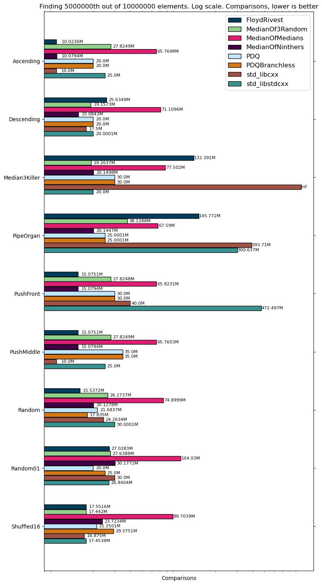
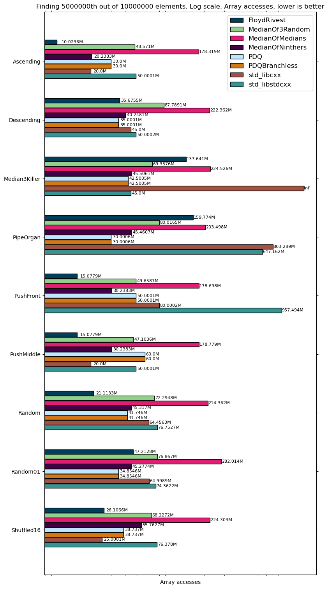
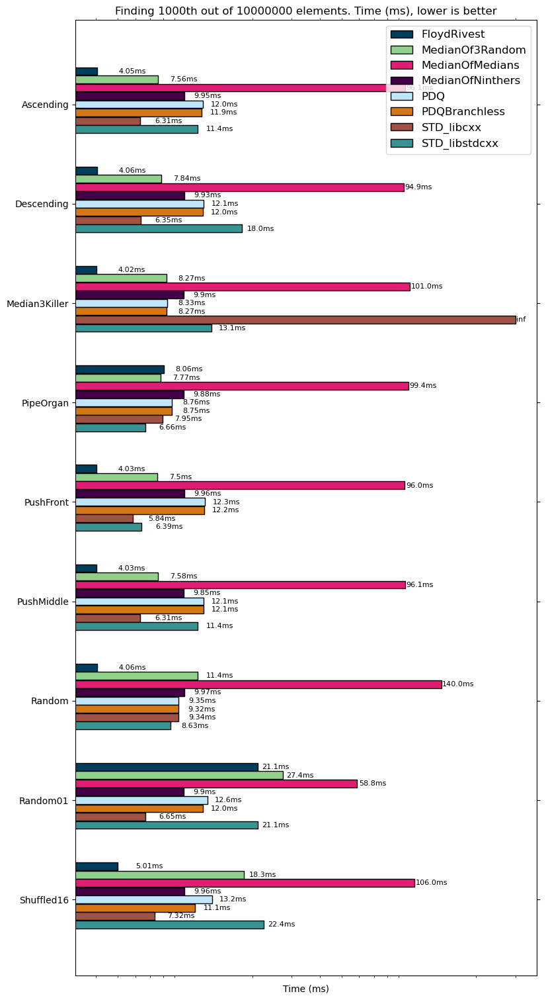
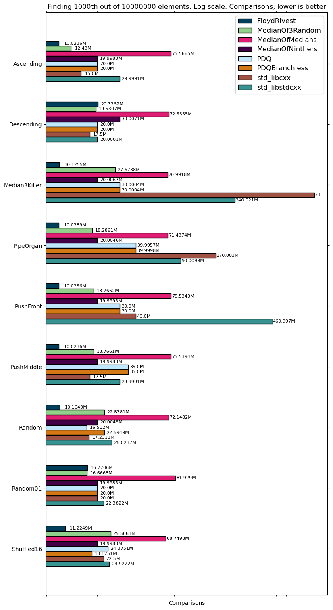
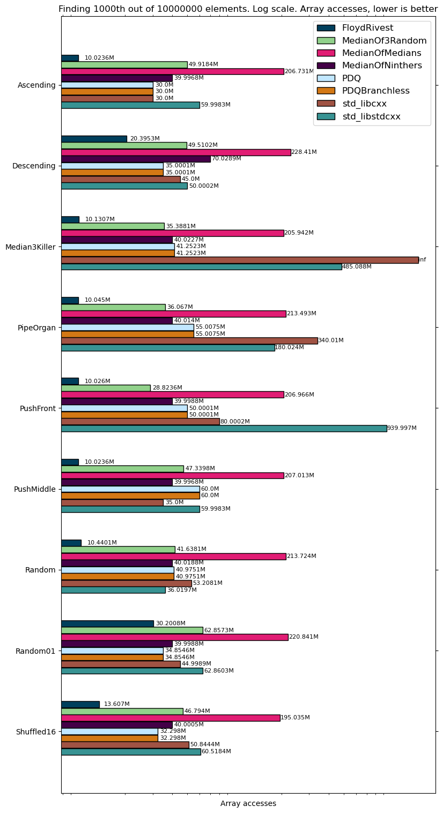

[](https://travis-ci.com/danlark1/miniselect)
[](https://www.boost.org/LICENSE_1_0.txt)

miniselect: Generic selection and partial ordering algorithms
==============================================================

`miniselect` is a C++ header-only library that contains various generic selection
and partial sorting algorithms with the ease of use, testing, advice on usage and
benchmarking.

Sorting is everywhere and there are many outstanding sorting algorithms that
compete in speed, comparison count and cache friendliness. However, selection
algorithms are always a bit outside of the competition scope, they are
pretty important, for example, in databases ORDER BY LIMIT N is used extremely
often which can benefit from more optimal selection and partial sorting
algorithms. This library tries to solve this problem with Modern C++.

* **Easy:** First-class, easy to use dependency and carefully documented APIs and algorithm properties.
* **Fast:** We do care about speed of the algorithms and provide reasonable implementations.
* **Standard compliant:** We provide C++11 compatible APIs that are compliant to the standard [`std::nth_element`](https://en.cppreference.com/w/cpp/algorithm/nth_element) and [`std::partial_sort`](https://en.cppreference.com/w/cpp/algorithm/partial_sort) functions including custom comparators and order guarantees. Just replace the names of the functions in your project and it should work!
* **Well tested:** We test all algorithms with a unified framework, under sanitizers and fuzzing.
* **Benchmarked:** We gather benchmarks for all implementations to better understand good and bad spots.

Table of Contents
-----------------

* [Quick Start](#quick-start)
* [Testing](#testing)
* [Documentation](#documentation)
* [Performance results](#performance-results)
* [Real-world usage](#real-world-usage)
* [Contributing](#contributing)
* [Motivation](#motivation)
* [License](#license)

Quick Start
-----------

You can either include this project as a cmake dependency and then use the
headers that are provided in the [include](./include) folder or just pass the
[include](./include) folder to your compiler.

```cpp
#include <iostream>
#include <vector>

#include "miniselect/median_of_ninthers.h"

int main() {
  std::vector<int> v = {1, 8, 4, 3, 2, 9, 0, 7, 6, 5};
  miniselect::median_of_ninthers_select(v.begin(), v.begin() + 5, v.end());
  for (const int i : v) {
    std::cout << i << ' ';
  }
  return 0;
}
// Compile it `clang++/g++ -I$DIRECTORY/miniselect/include/ example.cpp -std=c++11 -O3 -o example
// Possible output: 0 1 4 3 2 5 8 7 6 9
//                            ^ on the right place
```

Examples can be found in [examples](./examples).

We support all compilers starting from GCC 7 and Clang 6. We are also planning
to support Windows, for now it is best effort but no issues are known so far.

More on which algorithms are available, see [documentation](#documentation).
For overview of this work you can read the [article](https://danlark.org/2020/11/11/miniselect-practical-and-generic-selection-algorithms/)
in the author's blog.

Testing
-------

To test and benchmark, we use [Google benchmark](https://github.com/google/benchmark) library.
Simply do in the root directory:

```console
# Check out the libraries.
$ git clone https://github.com/google/benchmark.git
$ git clone https://github.com/google/googletest.git
$ mkdir build && cd build
$ cmake -DMINISELECT_TESTING=on -DBENCHMARK_ENABLE_GTEST_TESTS=off -DBENCHMARK_ENABLE_TESTING=off ..
$ make -j
$ ctest -j4 --output-on-failure
```

It will create two tests and two benchmarks `test_sort`, `test_select`,
`benchmark_sort`, `benchmark_select`. Use them to validate or contribute. You
can also use `ctest`.

Documentation
-------------

There are several selection algorithms available, further $n$ is the number
of elements in the array, $k$ is the selection element that is needed to be found (all algorithms are deterministic and not stable unless otherwise is specified):


| Name                      | Average                                                                                                   | Best Case                                                                                                 | Worst Case                                                                                                                | Comparisons                                                                                                                                                                                                                                                                                                                               | Memory                                                                                                                            |
|-------------------------  |---------------------------------------------------------------------------------------------------------  |---------------------------------------------------------------------------------------------------------  |-----------------------------------------------------------------------------------------------------------------------    |----------------------------------------------------------------------------------------------------------------------------------------------------------------------------------------------------------------------------------------------------------------------------------------------------------------------------------------   |---------------------------------------------------------------------------------------------------------------------------------  |
| [pdqselect](./include/miniselect/pdqselect.h)                 | $O(n)$   | $O(n)$   | $`O(n\log n)`$     | At least $2n$. Random data $2.5n$                                                                                                          | $O(1)$                           |
| [Floyd-Rivest](./include/miniselect/floyd_rivest_select.h)               | $O(n)$   | $O(n)$   | $O(n^2)$           | Avg: $n + \min(k, n - k) + O(\sqrt{n \log n})$                                                                                                                              | $`O(\log\log n)`$  |
| [Median Of Medians](./include/miniselect/median_of_medians.h)           | $O(n)$   | $O(n)$   | $O(n)$                   | Between $2n$ and $22n$. Random data  $2.5n$    | $O(\log n)$               |
| [Median Of Ninthers](./include/miniselect/median_of_ninthers.h)          | $O(n)$   | $O(n)$   | $O(n)$                   | Between $2n$ and $21n$. Random data $2n$       | $O(\log n)$              |
| [Median Of 3 Random](./include/miniselect/median_of_3_random.h)          | $O(n)$   | $O(n)$   | $O(n^2)$           | At least $2n$. Random data $3n$       | $O(\log n)$              |
| [HeapSelect](./include/miniselect/heap_select.h)          | $`O(n\log k)`$   | $O(n)$   | $`O(n\log k)`$           | $n\log k$ on average, for some data patterns might be better       | $O(1)$              |
| [libstdc++ (introselect)](https://github.com/gcc-mirror/gcc/blob/e0af865ab9d9d5b6b3ac7fdde26cf9bbf635b6b4/libstdc%2B%2B-v3/include/bits/stl_algo.h#L4748)   | $O(n)$   | $O(n)$   | $`O(n\log n)`$     | At least $2n$. Random data $3n$                                                                                                              | $O(1)$                             |
| [libc++ (median of 3)](https://github.com/llvm/llvm-project/blob/3ed89b51da38f081fedb57727076262abb81d149/libcxx/include/algorithm#L5159)     | $O(n)$   | $O(n)$   | $O(n^2)$           | At least $2n$. Random data $3n$                                                                                                              | $O(1)$                           |

For sorting the situation is similar except every line adds $O(k\log k)$ comparisons and pdqselect is using $O(\log n)$ memory.

## API

All functions end either in `select`, either in `partial_sort` and
their behavior is exactly the same as for
[`std::nth_element`](https://en.cppreference.com/w/cpp/algorithm/nth_element)
and [`std::partial_sort`](https://en.cppreference.com/w/cpp/algorithm/partial_sort)
respectively, i.e. they accept 3 arguments as `first`, `middle`, `end` iterators
and an optional comparator. Several notes:

* You should not throw exceptions from `Compare` function. Standard library
also does not specify the behavior in that matter.
* We don't support ParallelSTL for now.
* C++20 constexpr specifiers might be added but currently we don't have them
because of some floating point math in several algorithms.
* All functions are in the `miniselect` namespace. See the example for that.

- pdqselect
  - This algorithm is based on [`pdqsort`](https://github.com/orlp/pdqsort) which is acknowledged as one of the fastest generic sort algorithms.
  - **Location:** [`miniselect/pdqselect.h`](./include/miniselect/pdqselect.h).
  - **Functions:** `pdqselect`, `pdqselect_branchless`, `pdqpartial_sort`, `pdqpartial_sort_branchless`. Branchless version uses branchless partition algorithm provided by [`pdqsort`](https://github.com/orlp/pdqsort). Use it if your comparison function is branchless, it might give performance for very big ranges.
  - **Performance advice:** Use it when you need to sort a big chunk so that $k$ is close to $n$.

<p align="center"></p>

- Floyd-Rivest
  - This algorithm is based on [Floyd-Rivest algorithm](https://en.wikipedia.org/wiki/Floyd%E2%80%93Rivest_algorithm).
  - **Location:** [`miniselect/floyd_rivest_select.h`](./include/miniselect/floyd_rivest_select.h).
  - **Functions:** `floyd_rivest_select`, `floyd_rivest_partial_sort`.
  - **Performance advice:** Given that this algorithm performs as one of the best on average case in terms of comparisons and speed, we highly advise to
  at least try this in your project. Especially it is good for small $k$ or types that are expensive to compare (for example, strings). But even for median the benchmarks show it outperforms others. It is not easy for this algorithm to build a reasonable worst case but one of examples when this algorithm does not perform well is when there are lots of similar values of linear size (random01 dataset showed some moderate penalties).

We present here two gifs, for median and for $k = n/10$ order statistic.

<p float="left">
  
  
</p>

- Median Of Medians
  - This algorithm is based on [Median of Medians](https://en.wikipedia.org/wiki/Median_of_medians) algorithm, one of the first deterministic linear time worst case median algorithm.
  - **Location:** [`miniselect/median_of_medians.h`](./include/miniselect/median_of_medians.h).
  - **Functions:** `median_of_medians_select`, `median_of_medians_partial_sort`.
  - **Performance advice:** This algorithm does not show advantages over others, implemented for historical reasons and for bechmarking.

<p align="center"></p>

- Median Of Ninthers
  - This algorithm is based on [Fast Deterministic Selection](https://erdani.com/research/sea2017.pdf) paper by Andrei Alexandrescu, one of the latest and fastest deterministic linear time worst case median algorithms.
  - **Location:** [`miniselect/median_of_ninthers.h`](./include/miniselect/median_of_ninthers.h).
  - **Functions:** `median_of_ninthers_select`, `median_of_ninthers_partial_sort`.
  - **Performance advice:** Use this algorithm if you absolutely need linear time worst case scenario for selection algorithm. This algorithm shows some strengths over other deterministic [`PICK`](https://en.wikipedia.org/wiki/Median_of_medians) algorithms and has lower constanst than MedianOfMedians.

<p align="center"></p>

- Median Of 3 Random
  - This algorithm is based on QuickSelect with the random median of 3 pivot choice algorithm (it chooses random 3 elements in the range and takes the middle value). It is a randomized algorithm.
  - **Location:** [`miniselect/median_of_3_random.h`](./include/miniselect/median_of_3_random.h).
  - **Functions:** `median_of_3_random_select`, `median_of_3_random_partial_sort`.
  - **Performance advice:** This is a randomized algorithm and also it did not show any strengths against Median Of Ninthers.

<p align="center"></p>

- Introselect
  - This algorithm is based on [Introselect](https://en.wikipedia.org/wiki/Introselect) algorithm, it is used in libstdc++ in `std::nth_element`, however instead of falling back to MedianOfMedians it is using HeapSelect which adds logarithm to its worst complexity.
  - **Location:** `<algorithm>`.
  - **Functions:** `std::nth_element`.
  - **Performance advice:** This algorithm is used in standard library and is not recommended to use if you are looking for performance.

<p align="center"></p>

- Median Of 3
  - This algorithm is based on QuickSelect with median of 3 pivot choice algorithm (the middle value between begin, mid and end values), it is used in libc++ in `std::nth_element`.
  - **Location:** `<algorithm>`.
  - **Functions:** `std::nth_element`.
  - **Performance advice:** This algorithm is used in standard library and is not recommended to use if you are looking for performance.

<p align="center"></p>

- `std::partial_sort` or `HeapSelect`
  - This algorithm has [heap-based solutions](https://en.wikipedia.org/wiki/Partial_sorting) both in libc++ and libstdc++, from the first $k$ elements the max heap is built, then one by one the elements are trying to be pushed to that heap with HeapSort in the end.
  - **Location:** `<algorithm>`, [`miniselect/heap_select.h`](./include/miniselect/heap_select.h).
  - **Functions:** `std::partial_sort`, `heap_select`, `heap_partial_sort`.
  - **Performance advice:** This algorithm is very good for random data and small $k$ and might outperform all selection+sort algorithms. However, for descending data it starts to significantly degrade and is not recommended for use if you have such patterns in real data.

<p align="center"></p>

## Other algorithms to come

* Kiwiel modification of FloydRivest algorithm which is described in [On Floyd and Rivest’s SELECT algorithm](https://core.ac.uk/download/pdf/82672439.pdf) with ternary and quintary pivots.
* Combination of FloydRivest and pdqsort pivot strategies, currently all experiments did not show any boost.

Performance results
-------------------

We use 10 datasets and 8 algorithms with 10000000 elements to find median and
other $k$ on `Intel(R) Core(TM) i5-4200H CPU @ 2.80GHz` for `std::vector<int>`,
for median the benchmarks are the following:






For smaller $k$,
for example, 1000, the results are the following







Other benchmarks can be found [here](https://drive.google.com/drive/folders/1DHEaeXgZuX6AJ9eByeZ8iQVQv0ueP8XM).


Real-world usage
----------------

- [ClickHouse Inc.](https://github.com/ClickHouse/ClickHouse): Fast Open-Source OLAP DBMS
- [YDB](https://github.com/ydb-platform/ydb/commit/698b400d09b3c1c7aff6ebf986eb3dc3ced74a08): Open-Source Distributed SQL Database
- [cpp-sort](https://github.com/Morwenn/cpp-sort): Largest Sorting algorithms & related tools for C++

If you are planning to use miniselect in your product, please work from one of
our releases and if you wish, you can write the acknowledgment in this section
for visibility.

Contributing
------------

Patches are welcome with new algorithms! You should add the selection algorithm
together with the partial sorting algorithm in [include](./include), add
tests in [testing](./testing) and ideally run benchmarks to see how it performs.
If you also have some data cases to test against, we would be more than happy
to merge them.

Motivation
----------

The author was surveying research on small
$k$
in selection algorithms and was struggling to find working implementations to
compare different approaches from standard library and quickselect algorithms.
It turned out that the problem is much more interesting than it looks, and after
consulting The Art of Computer Programming from Donald Knuth about
minimum comparison sorting and selection algorithms, the author decided to look
through unpopular algorithms and try them out. Not finding any satisfactory
library for selection algorithms nor research corresponding to the open source codes,
the author set out to write one generic library.

For a big story of adventures see
the author's [blog post](https://danlark.org/2020/11/11/miniselect-practical-and-generic-selection-algorithms/).

License
-------

The code is made available under the [Boost License 1.0](https://boost.org/LICENSE_1_0.txt).

Third-Party Libraries Used and Adjusted
---------------------------------------

| Library             | License                                                                                          |
|---------------------|--------------------------------------------------------------------------------------------------|
| pdqsort             | [MIT](https://github.com/orlp/pdqsort/blob/47a46767d76fc852284eaa083e4b7034ee6e2559/license.txt) |
| MedianOfNinthers    | [Boost License 1.0](https://github.com/andralex/MedianOfNinthers/blob/master/LICENSE_1_0.txt)    |

